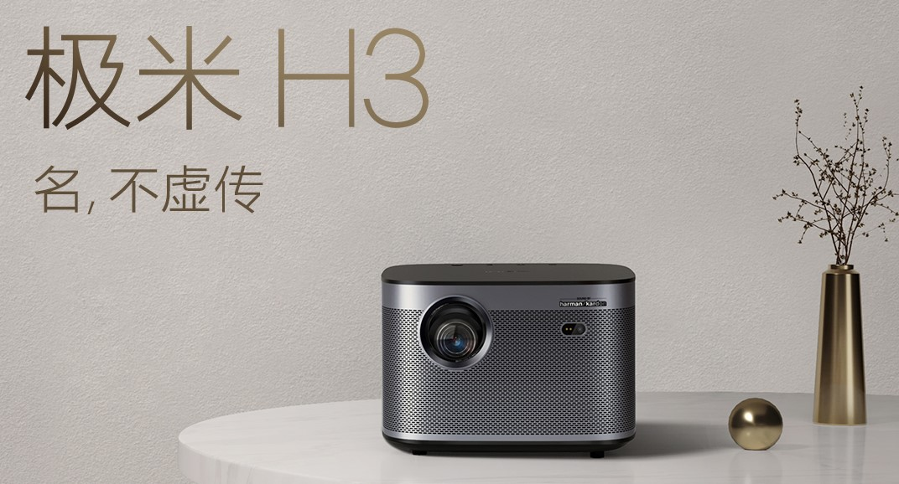

# 极米H3测评——稳健型主力投影

---

<div align = center><a href="http://www.weibo.com/rainssong">@rainssong</a> 发布于：2019-4-13</div>

<br>

```
版权申明©：
本文首发于www.rainssong.com 
微博：rainssong 
未经授权不得转载、修改
```

---



> 虽然对比文章比单独评测更加有参考价值，但是考虑再三还是不写了
> 
> 1.一捧一踩很像软文即便实际上真的就是差距蛮大。
> 
> 2.这类文章确实软文很多，少看。
> 
> 3.拿不准的时候就像我一样各买一个你就知道我说的是不是准确）

为了买投影，又做了一个月的功课（我怎么那么闲？

这里先回答几个常见问题：

>Q：投影仪是不是寿命短？  
>A：过去是的，现在已经是LED灯，正常寿命20000小时，一般用个五年内没问题，超过寿命后亮度逐渐降低。

>Q：发热？  
>A：是电器都会发热，H3发热其实不多。

>Q：风扇噪音？  
>A：这个我要好好说说，好的投影仪真没啥噪音，感觉比电脑风扇声音还小。  

>Q：亮度不够，白天没有遮光窗帘不行！  
>A：亮度没法和电视比，毕竟一个主动发光一个靠反光。但是有几点要说明：

   > 1. 太亮了对眼睛不好，投影仪我都不开高亮的，我嫌刺眼
   > 2. 白天看电视效果也会变差
   >3. 不需要把屋子全部遮挡，有光完全是OK的，只要是普通窗帘挡了就行

>Q：不清晰！  
>A：这也是投影的硬伤之一，但是要注意：投影糊有一部分原因是因为大（投射距离远），就算是60寸电视放大4倍也会糊掉。如果你希望看高清，其实只要把投影拿近一些，也是很清晰的。

>Q：怕踩坑啊！  
>A：七天无理由。怕坏的再买个延保。

## 为什么选择智能投影

目前市面上可选的投影其实很多，但是我没有选择传统投影，理由：

1. 传统投影功能单一，需要搭配电视盒子、音箱、网线、电脑才能满足我的需求。
2. 接一大堆线，接口不够用。
3. 家庭用投影仪最佳位置是放在高处，那样场面更加混乱，线也要拉很长。

所以购买智能投影，内置系统，无线访问，下一些视频App，就可以一站式解决以上问题。
市面上智能投影只有那么几家：极米，坚果，天猫，小米，当贝（自称宇宙最强，不信知乎搜搜）。

## 为什么选择极米H3

趁着购物节买了两款作为对比，并且还去过线下店，最终选择极米H3。下面从各个环节评测：

（另一款投影仪一开始好感度很高，结果买来一对比发现呵呵哒，其实对比文章比单独评测更加有参考价值，但是考虑再三还是不写了——1.一捧一踩很像软文即便实际上真的高下立判，2.对比文章基本都是软微，买之前看得津津有味，买了一看发现纯属放P，唯一客观的是B站小Up主做的视频，所以文章少看！）

**亮度：** 官方标称流明1900ANSI，咱也不懂咱也不敢问，这里拍夜晚和白天少量阳光直射作为对比：

* 夜晚亮度2
 
* 白天亮度2
 
* 夜晚亮度4
   
* 白天亮度4
   
* 夜晚亮度10
   
* 白天亮度10
   

**实际使用中的感受**：

1. 只要不是强光直射屏幕，不影响观看，白天不用把家里搞成地下室。
2. 利用调高亮度可大大减少外部光源干扰
3. 最高亮度对于我来说着实用不着，从保护视力的角度来说，亮度也不需要那么高。

**清晰度：** 由于是1920x1080的分辨率，是否清晰很大程度上取决于屏幕大小，如果距离幕布近的话，屏幕小了，自然就会清晰很多。（自然不能和激光电视比

**噪音和散热：** 表现令人满意，机器基本不发热（可能是我亮度常年低于5的缘故），缺点是冬天无法暖手。

**投射比：** 距离:宽度=1.2:1，人眼最大舒适视角36度，距离:宽度=1.56:1。投影画面略大于人眼舒适画面，放在人前方，可以投出舒适尺寸，放在人后方就看个人选择，觉得大就变焦。

**音响：** 曼哈顿音箱，低音厚实，整体也比较饱满。家里没有买专业音箱，现在我已经用它作为日常的蓝牙音箱来使用了。

**自动校正：** 支持侧投，自动调焦。实际使用中发现那只是辅助功能，还是需要手动微调。当然，聊胜于无。而且投影一旦选好位置，就不需要这两个功能了。

**动态补偿：** 可以说用了之后就再也离不开了，60帧与30帧完全是两个世界，这里给大家看看区别：

<iframe height=600 width=800 src='http://player.youku.com/embed/XNDQzNjQ3NzE0MA==' frameborder=0 'allowfullscreen'></iframe>

说完硬件，看看软件方面：

**系统：** 操控流畅，除开机时画面无明显延迟，随之带来的问题是，系统杀后台进程比较积极。（所以不要拿他自身的系统办公。另外系统较为封闭，我举个例子，切换输入法的入口都是隐藏起来的。。。

**本地视频：** 自带播放器其实还不错，只是遇到mkv就傻了，还是kodi吧。另外资源管理器支持局域网共享文件，为什么要单拧出来说？首先另一个投影仪的资源管理器在访问免密的共享文件夹时竟然要求我输入密码，然后不管输入什么都无法访问（苦笑）。第二，USB 2.0传输效率一般，还不如使用网线和Wifi来的方便，前提是家里网络要足够给力。

**投屏：** 提供了六种模式，覆盖主流四种系统。夫复何求啊？非要挑刺的话，Miracast有延迟，也经常出现连不上的情况，AirPlay延迟很低但是偶尔卡顿，但我认为这是技术本身和网络环境的原因。投影仪这里优化空间不大。

**软件：** 自带应用商城只能用寒碜来形容，不过App质量相对有保障。尝试安装过一些手机用App和游戏App，发现有一些会崩溃，可能是权限不够的原因？

**操控：** 可以用微信、手机App、PS4手柄、外接键盘、外接鼠标。基本齐活儿。实际使用发现蓝牙偶尔会打架（抢占同一个信道导致延迟极高，用手机控制重新匹配就好了）。官方称只支持两个蓝牙设备（除去遥控只有一个坑了），但是我试过接4个也能用，所以还是看缘分。。。

另外，遥控上有语音操控，虽然百度很那啥，但是他家的小度语音助手是真的溜，识别率极高（毕竟砸钱。。。）

**游戏：** TV游戏都是些坑货，不如自己装模拟器或者接游戏机，绑定手柄，岂不美哉？有人说投影打游戏有60ms+延迟，实际使用中没有感觉，理论上也不应该有。毕竟投影仪就是亮度很高屏幕很小的显示器，没理由延迟变高。甚至网络给力的话，云游戏延迟也在60ms内。

**电视：** 央视有App，主流视频网站都有App，其他地方台可能要自己去找第三方App才能看了。也可以接机顶盒。

**音频：** 有耳机孔与ARC两个固定选项，可以接耳机和功放。但系统没有做音频输出设备检测，这样有个啥问题呢？我举个蛋疼的例子，蜀黍把PS4的手柄插上去，就可以代替遥控来操作投影，非常爽是吧？然而就再也听不到声音了，除非手柄上再插个耳机。另外一些带声音输出的设备也会出类似问题，比如某些USB麦克风。

## 总结

**优点：**

* 梯形校正，支持侧投
* 噪音低，基本听不到
* 系统流畅
* 亮度高，白天可看
* 音响效果不错，平时可作为蓝牙音箱使用
* 线下门店，先看再买
* 客服回复及时，有问必答
* 1920x1080p，画面清晰
* 动态补偿，显示流畅
* 游戏模式，延迟在可接受范围
* 双HDMI接口，避免频繁插拔。
* 无线投屏支持完整，打通各大平台
* 双USB口，可接外设
* 语音助手体验好
* 三秒无广告开机

**缺点：**

* 系统相对封闭，无法Root
* 权限限制，部分小众TV App和一些手机App无法运行
* 蓝牙支持很奇怪，信道冲突可能导致遥控失灵
* USB2.0接口，速度有限
* 自带商店应用太少
* 自动调焦和梯形校正无法到最佳清晰度，只能作为辅助
* 自带播放器不支持mkv，需要下载专业播放器
* 没有音频输出检测
* 一些外接信号可能不支持hdr

总评：瑕不掩瑜，买入评级

**扩展阅读：**

[如何将你的智能投影仪发挥到极致？](http://rainssong.github.io)

[随机漫步的玩家专栏，看更多有趣的测评](https://zhuanlan.zhihu.com/iwander)

**直达连接：**

[狗东](https://union-click.jd.com/jdc?e=&p=AyIGZRtSFAIXBFYfXhQyFARWG1wVARcPUB5rUV1KWQorAlBHU0VeBUVNR0ZbSkdETlcNVQtHRVNSUVNLXANBRA1XB14DS10cQQVYD21XHgFWGFsSAhECXR5eJQJtRFNFHnR0cVABRShBellxHEdZElQeC2UbWxMEEg9lG1oUAhoGVhlZHTIiB1YrGnsCEwdRGV4SBSIHXR5cFAQbD1UfaxUFEwdSH1IXBRQAVRNrEgIbNwBPC1ZRTE8TQBMlMhQEVhtcFQEXD1AeaxYyIjdVK1glQHxUVhNfF1AXAlwbUhEHG1NWSF8SC0EAAU9TEQETUwAbXyUAEwZREg%3D%3D)

[极米官网](https://j.youzan.com/5ZMTjY)

[](https://j.youzan.com/5ZMTjY)

**配件**

[3D眼镜（购买前先问问是否有赠送活动）](https://union-click.jd.com/jdc?e=&p=AyIGZRJdHQYVBlQeWiUCEwZUGlgcARUPUBNrUV1KWQorAlBHU0VeBUVNR0ZbSkdETlcNVQtHRVNSUVNLXANBRA1XB14DS10cQQVYD21XHgdUGloUARsEUhNeHTJpexBfU3J1QGQUeR9CRgx%2BLHJZQ0JiC1krWiUCEwZVE1oWABAPZStbEjJEaVUaWhQDEwZRElglAyIHURJaEwATAFwTUhcFIgBVEmtAVkJEBkUTU1laN2UrWCUyIgdlGGtKRk9aZRlaFAYb)

[墙壁支架](https://union-click.jd.com/jdc?e=&p=AyIGZRNcEgcTAF0SUiUCEwNWHFwdABQBVisfSlpMWGVCHlBDUAxLBQNQVk4YCQQAQB1AWQkFHUVBRhkSQw9THUJVEEMFSgxUVxZPI0AOEgZRGFwSChABUxhrSkVodRwFAGxnEWUlBSFnShJzCVMHZQ4eN1QrWxQDEg9UGFkXCiI3VRxrVGwSBFcaUxwyEzdVH1IUBBAGURtTEAQVN1IbUiVXRlcWSAVdRElPZStrFjIiN1UrWCVAfA9VT1gdAxAOXU5dQgcXV1VIWBMGEFdWTAkQChUDXRhfJQATBlES)

欢迎留言讨论，觉得好用点个收藏。
